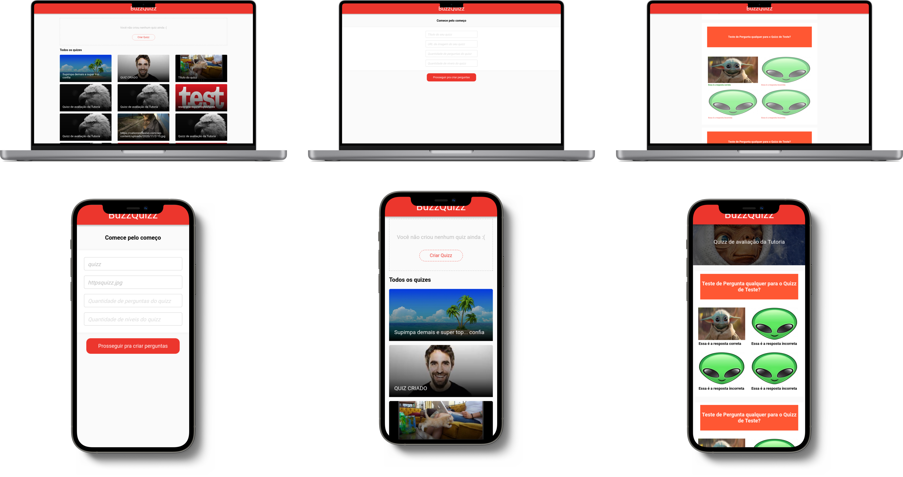

<p align="center">
  <a href="https://raferdev.github.io/buzzquiz/">
 </a>
</p>

<h3 align="center">Buzzquiz</h3>

<div align="center">

[]()
[](https://github.com//raferdev/buzzquiz/issues)
[](https://github.com/raferdev/buzzquiz/pulls)
[](/LICENSE)

</div>

---



<p align="center"> This is a HTML + CSS + Javascript project based on the site 
<a href="https://buzzfeed.com.br/feed/quiz">Buzzquiz</a>, you can create your quizzes, and search by quizzes of the open community.
</p>

## 📝 Table of Contents

- [About](#about)
- [Getting Started](#getting_started)
- [Usage](#usage)
- [Built Using](#built_using)
- [Authors](#authors)

## 🧐 About <a name = "about"></a>

This project has been made by two software developers in one week. The objective of this site is to user create a custom quiz, find your quizzes and of another users, answer them and have fun. This project have responsive display.

## 🏁 Getting Started <a name = "getting_started"></a>

You can clone the project and start on your local host or open the site hospeded <a href="https://raferdev.github.io/buzzquiz/">here</a>.

Clone

 ```
 git clone https://github.com/raferdev/buzzquiz
 ```

## 🎈 Usage <a name="usage"></a>
- First wait to load page to find new quizzes.
- You can see the images and titles of the quizzes of community, and can select them.
- You can click on 'Create Quizz' to create your custom quiz and show on list.
- Now enjoy.
## ⛏️ Built Using <a name = "built_using"></a>

- [HTML](https://developer.mozilla.org/pt-BR/docs/Web/HTML) - Markup Language
- [CSS](https://developer.mozilla.org/pt-BR/docs/Web/CSS) - Style Language
- [JS](https://developer.mozilla.org/pt-BR/docs/Web/javascript) - Interative Language

## ✍️ Authors <a name = "authors"></a>

- [@raferdev](https://github.com/raferdev)
- [@f7lipe](https://github.com/f7lipe)